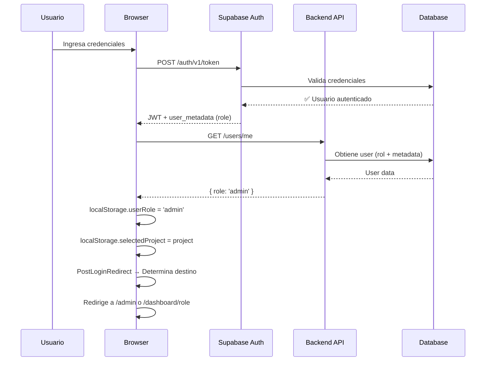
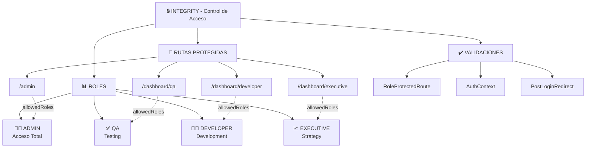
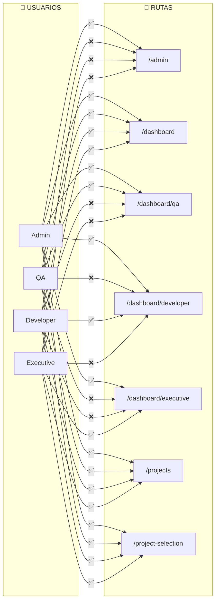
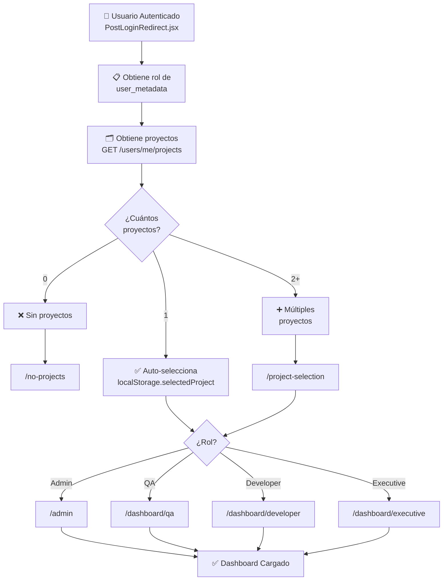
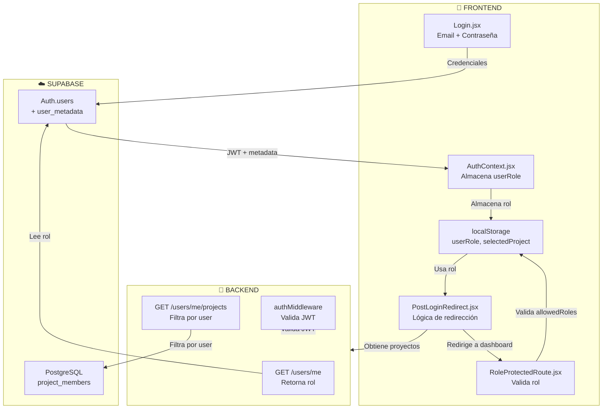
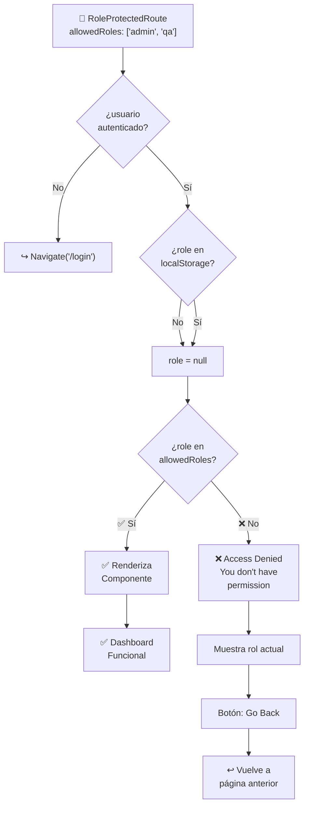
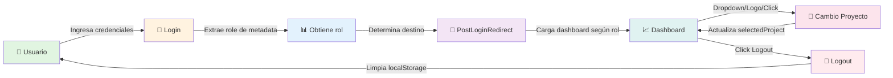
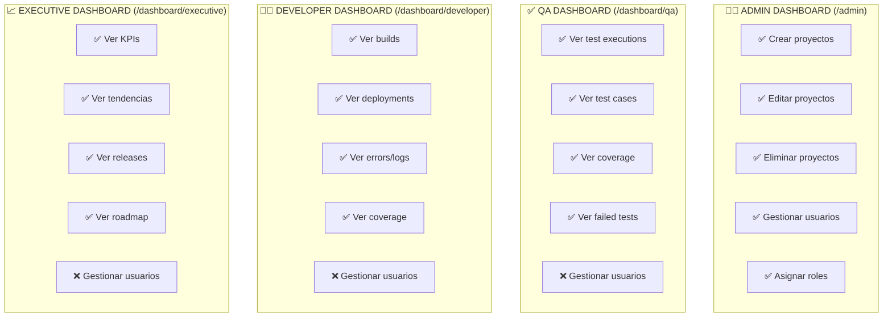
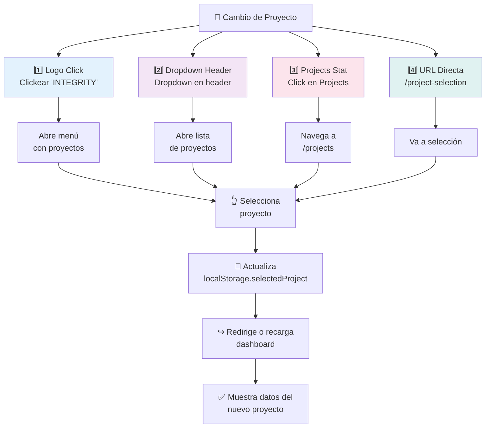
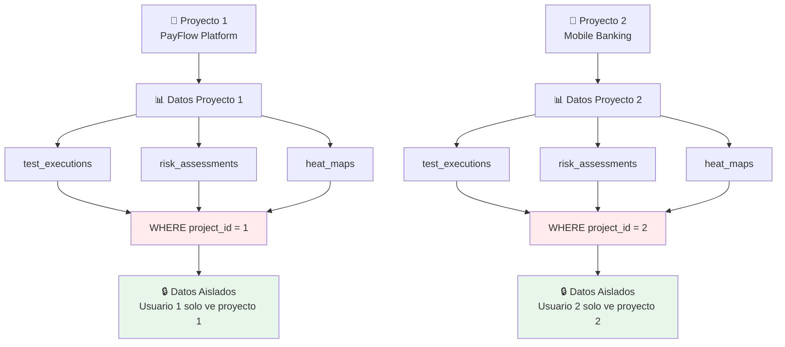

# Diagrama de Arquitectura de Roles y Permisos

## 1. Flujo de Autenticación y Autorización

## 2. Estructura de Roles y Jerarquía

## 3. Matriz de Acceso - Todas las Rutas

## 4. Flujo Post-Login por Rol

## 5. Componentes de Seguridad y Flujo

## 6. RoleProtectedRoute - Flujo de Validación

## 7. Ciclo de Vida de Sesión

## 8. Matriz de Permisos por Dashboard

## 9. Cambio de Proyecto - 4 Métodos

## 10. Aislamiento de Datos por Proyecto

