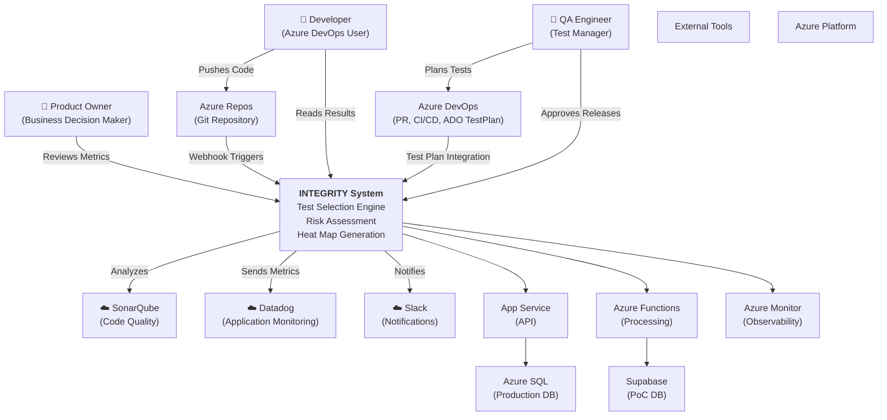
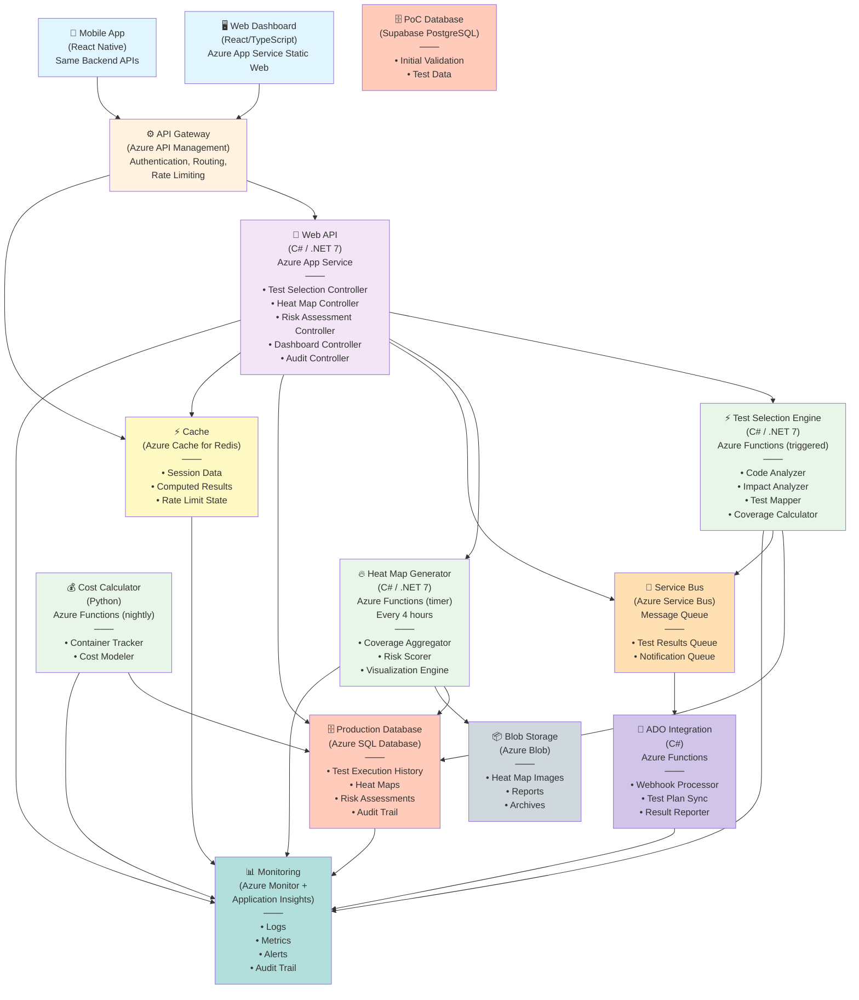
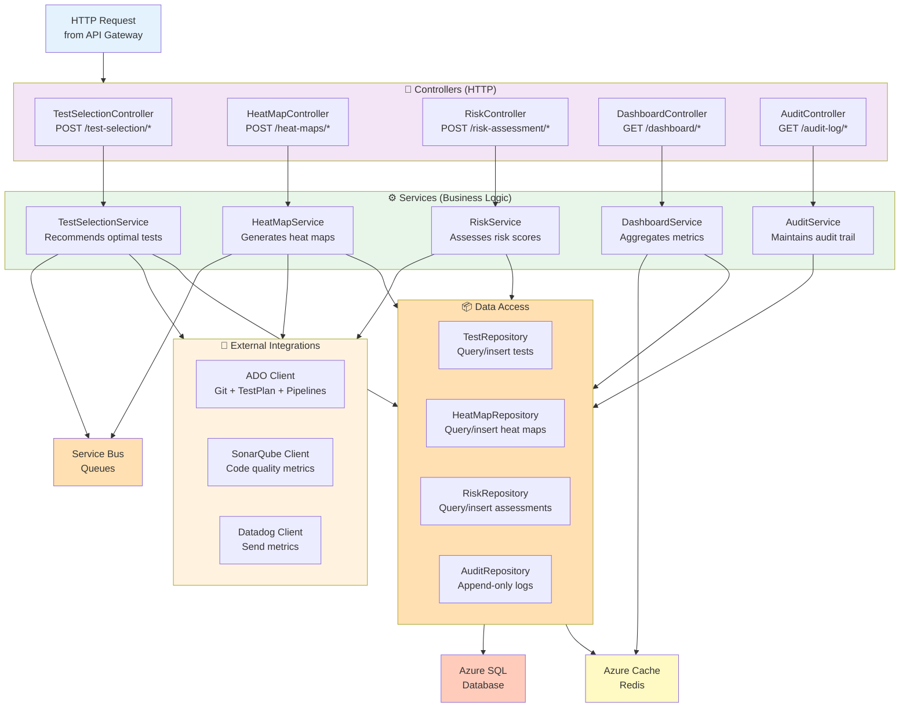
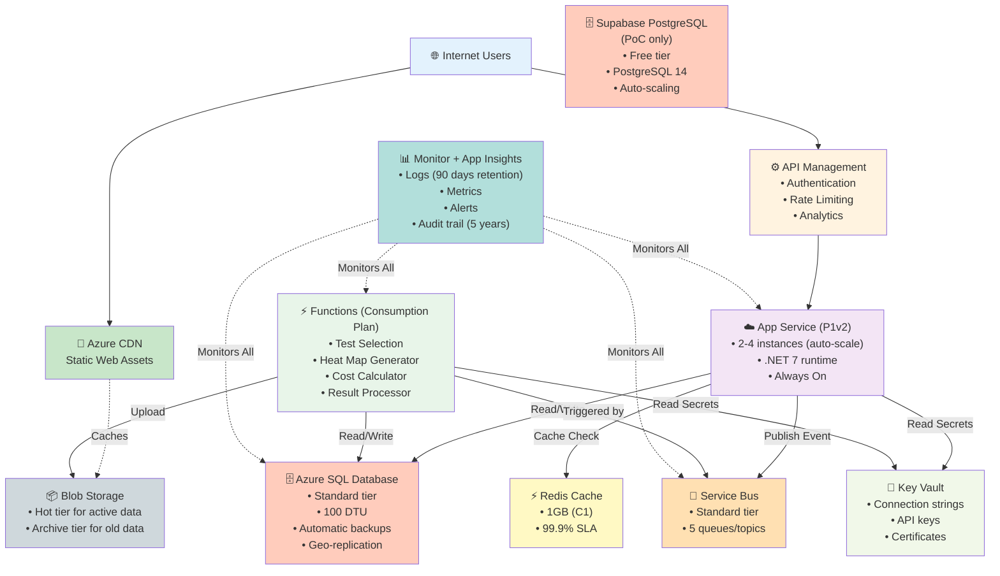

# C4 Architecture Diagrams: Project INTEGRITY

**Autonomous Quality Intelligence Ecosystem (AQIE)**

*System Context, Containers, Components, and Code-Level Architecture*

---

## C4 Model Overview

The C4 model consists of four levels:
1. **System Context** - Shows INTEGRITY and its external systems
2. **Container** - Shows major technology containers (API, Database, etc.)
3. **Component** - Shows internal components within containers
4. **Code** - Shows code-level architecture (classes, interfaces)

---

## Level 1: System Context Diagram

### Overview

```
External Systems & Integrations with Project INTEGRITY
```

### Diagram



### Actors

| Actor | Role | Interactions |
|-------|------|---|
| **Developer** | Code contributor | Pushes commits, reviews results, reads heat map |
| **QA Engineer** | Test executor | Plans tests, reviews recommendations, approves releases |
| **Product Owner** | Business decision maker | Reviews metrics, approves deployments |

### External Systems

| System | Purpose | Protocol |
|--------|---------|----------|
| **Azure DevOps** | SCM, CI/CD, test management | REST API, OAuth 2.0 |
| **SonarQube** | Code quality metrics | REST API |
| **Datadog** | Application performance monitoring | HTTP agent, API |
| **Slack** | Notifications | Webhooks |
| **Azure Platform** | Infrastructure | Azure SDK, managed services |

---

## Level 2: Container Diagram

### Technology Stack

```
Client Layer (Frontend)
    ↓
API Layer (Azure App Service, .NET 7)
    ↓
Processing Layer (Azure Functions, async)
    ↓
Data Layer (Azure SQL + Supabase)
    ↓
Integration Layer (Azure Service Bus)
```

### Diagram



### Container Technologies

| Container | Technology | Purpose | Scaling |
|-----------|-----------|---------|---------|
| **Web Dashboard** | React 18 + TypeScript | User interface | Static, CDN-fronted |
| **API Gateway** | Azure API Management | Request routing, auth, rate limiting | Managed, auto-scaling |
| **Web API** | C# / .NET 7 | Core business logic | Azure App Service (B1→P1v2) |
| **Functions** | C# / .NET 7 | Async processing | Pay-per-execution, 100% auto-scale |
| **Database** | Azure SQL / Supabase | Persistent storage | Database unit scaling |
| **Blob Storage** | Azure Blob | Large files, archives | Auto-scaling |
| **Service Bus** | Azure Service Bus | Async messaging | Standard/Premium tiers |
| **Cache** | Azure Cache for Redis | Session, computed results | C0→C6 scaling |
| **Monitoring** | Azure Monitor + App Insights | Observability | Ingestion-based scaling |

---

## Level 3: Component Diagram (Web API Container)

### Internal Structure

```
Web API (.NET 7 Application)
  ├── Controllers (HTTP Endpoints)
  ├── Services (Business Logic)
  ├── Repositories (Data Access)
  └── External Integrations
```

### Diagram



### Key Components

| Component | Responsibility | Dependencies |
|-----------|---------------|----|
| **TestSelectionController** | HTTP endpoint for test recommendations | TestSelectionService, ADO Client |
| **TestSelectionService** | Core algorithm for test selection | ADO, SonarQube, Data layer |
| **TestRepository** | Query/insert test execution records | Azure SQL, Cache |
| **AuditService** | Maintains immutable audit trail | AuditRepository |
| **DashboardService** | Aggregates KPIs and metrics | All repositories, Cache |

---

## Level 4: Code Diagram (Test Selection Service)

### Class Structure

```
TestSelectionService
  │
  ├─ Dependencies
  │  ├─ IADOClient (Azure DevOps integration)
  │  ├─ ISonarQubeClient (code quality metrics)
  │  ├─ ITestRepository (data access)
  │  └─ ICacheService (performance optimization)
  │
  ├─ Core Methods
  │  ├─ AnalyzeCodeChanges(...)
  │  │  └─ → List<FileChange>
  │  │
  │  ├─ RecommendTests(...)
  │  │  └─ → TestRecommendation
  │  │
  │  └─ CalculateImpactScore(...)
  │     └─ → double (0.0 - 10.0)
  │
  └─ Models
     ├─ CodeChange
     ├─ TestCase
     └─ TestRecommendation
```

### Pseudo-Code

```csharp
public class TestSelectionService
{
    private readonly IADOClient _ado;
    private readonly ISonarQubeClient _sonarQube;
    private readonly ITestRepository _tests;
    private readonly ICacheService _cache;
    
    public async Task<IEnumerable<TestRecommendation>> RecommendTestsAsync(
        string repositoryId, 
        string baseBranch, 
        string headBranch,
        SelectionStrategy strategy)
    {
        // Step 1: Analyze code changes
        var changes = await _ado.GetCodeChangesAsync(repositoryId, baseBranch, headBranch);
        
        // Step 2: Get code quality metrics
        var qualityData = await _sonarQube.GetMetricsAsync(repositoryId, changes.Select(c => c.File));
        
        // Step 3: Load historical test data
        var historicalTests = await _tests.GetHistoricalDataAsync(repositoryId);
        
        // Step 4: Score each test for relevance
        var scoredTests = new List<ScoredTest>();
        foreach (var test in historicalTests)
        {
            var relevanceScore = CalculateRelevanceScore(
                test,
                changes,
                qualityData,
                strategy);
            scoredTests.Add(new ScoredTest(test, relevanceScore));
        }
        
        // Step 5: Select tests based on strategy and constraints
        var selected = SelectTestsBasedOnStrategy(scoredTests, strategy);
        
        // Step 6: Cache results for 1 hour
        await _cache.SetAsync($"recommendations:{repositoryId}", selected, TimeSpan.FromHours(1));
        
        return selected;
    }
    
    private double CalculateRelevanceScore(
        TestCase test,
        IEnumerable<CodeChange> changes,
        QualityMetrics metrics,
        SelectionStrategy strategy)
    {
        double score = 0.0;
        
        // Factor 1: Coverage impact (40%)
        var coverageImpact = test.CoveredLines.Intersect(changes.SelectMany(c => c.ModifiedLines)).Count();
        score += (coverageImpact / (double)test.CoveredLines.Count()) * 4.0;
        
        // Factor 2: Historical defect detection (30%)
        var historicalEffectiveness = test.DefectsDetected / (double)test.ExecutionCount;
        score += historicalEffectiveness * 3.0;
        
        // Factor 3: Code complexity (20%)
        var complexityFactors = changes
            .Where(c => test.CoveredLines.Contains(c.LineNumber))
            .Select(c => metrics[c.File].Complexity);
        score += complexityFactors.Average() * 2.0;
        
        // Factor 4: Test reliability (10%)
        var reliability = (1.0 - test.FlakinessScore);
        score += reliability * 1.0;
        
        return Math.Min(score, 10.0); // Cap at 10.0
    }
}
```

---

## Deployment Architecture

### Azure Infrastructure



### Cost Model by Component

| Component | Monthly Cost | Annual Cost | Utilization |
|-----------|--------------|------------|-------------|
| **App Service (P1v2)** | $8,000 | $96,000 | 60% average |
| **Azure SQL (Standard)** | $6,667 | $80,000 | 45% peak |
| **Functions** | $400 | $4,800 | Pay-per-execution |
| **Cache (Redis C1)** | $3,750 | $45,000 | Session data |
| **Service Bus (Standard)** | $2,500 | $30,000 | 10K msgs/day avg |
| **Storage (Blob + Archive)** | $1,667 | $20,000 | 500GB active, 1TB archive |
| **Monitor/App Insights** | $16,667 | $200,000 | Comprehensive logging |
| **CDN** | $667 | $8,000 | 10GB/month transfer |
| **Key Vault** | $50 | $600 | Standard tier |
| **Support & Misc** | $1,250 | $15,000 | Premium support |
| | | | |
| **TOTAL PRODUCTION** | $55,208 | $665,000/yr | (reserved pricing applied) |

---

## Document Information

**Created:** April 30, 2026  
**Phase:** 05-Architecture  
**Skill:** C4 Diagrams  
**Approver:** Technical Lead (Architecture Review)  
**Status:** ⏳ PENDING APPROVAL  
**Version:** 1.0

**Diagrams Include:**
- Level 1: System Context (6 external systems)
- Level 2: Container (11 major containers)
- Level 3: Component (5 services + data layer)
- Level 4: Code (TestSelectionService class structure)
- Deployment: Azure infrastructure with 12 services, cost breakdown
